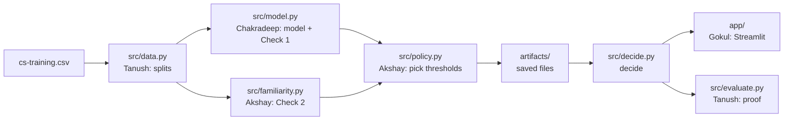

# TrustLend prototype build guide

Sep 25, 2026 · @Akshay

The prototype is a working app: type in a loan applicant and TrustLend says approve, deny, or send to a human, with the reasons. Behind it sits a pipeline we can prove works on 150,000 real borrowers. Each of you builds one piece, and all the pieces meet at one Python function, `decide()`.

## What we're building

The finished prototype has two halves. The **build half** runs once: it trains the model, builds Check 2 and picks the two thresholds, then saves everything to files. The **app half** loads those files and answers one applicant at a time, in under a second. Nothing is trained during the demo, so it can't surprise us on stage.



Every arrow into `decide()` is somebody's job. Everything after it (the app and the proof) only ever calls `decide()`.

The folder layout. Each person owns their own files, so you rarely edit the same file as someone else:

```
trustlend/
├── data/                  cs-training.csv lives here, never pushed to GitHub
├── artifacts/             saved model and thresholds, never pushed either
├── src/
│   ├── data.py            Tanush
│   ├── model.py           Chakradeep
│   ├── familiarity.py     Akshay
│   ├── policy.py          Akshay
│   ├── decide.py          Akshay
│   └── evaluate.py        Tanush
├── scripts/
│   └── build.py           runs the whole build half in one go
├── app/
│   ├── Home.py            Gokul
│   └── pages/             Gokul
├── requirements.txt
├── .gitignore
└── README.md
```

## Who does what

Each of you builds the part you talked about in the pitch, so every answer you gave the jury becomes something you built yourself.

| Person | Builds | Files | What you said in the pitch |
| --- | --- | --- | --- |
| Akshay | Check 2, the two thresholds, `decide()`, the GitHub repo | `src/familiarity.py`, `src/policy.py`, `src/decide.py`, `scripts/build.py` | Check 2 and applicant #34771 |
| Chakradeep | The loan model, the 17% cutoff, Check 1 | `src/model.py` | How TrustLend works and Check 1 |
| Tanush | Loading the data, the splits, the typo test set, the results | `src/data.py`, `src/evaluate.py` | Three real applicants and the early results |
| Gokul | The app: apply page, reviewer screen, audit log, dashboard | `app/` | The reviewer screen and the roadmap |

The order work has to happen in:

1. **Step 0** (everyone, together): set up. Nobody starts coding before this is done.
2. **Step 1** (Akshay, about 30 minutes): the fake `decide()`. It unblocks Gokul straight away.
3. **Steps 2, 3, 5 happen at the same time**: Tanush does the data, Chakradeep does the model, Gokul builds the app against the fake `decide()`.
4. **Step 4** (Akshay) needs Tanush's splits and Chakradeep's model, so Akshay starts with Check 2 on a quick split of his own and switches to Tanush's when it lands.
5. **Step 6** (Tanush) needs the real `decide()`.
6. **Step 7** (everyone): swap the fake `decide()` for the real one and rehearse the demo.

The rule that makes this work: **nobody waits for anybody.** If the piece you need isn't ready, use a fake version of it and keep going.

## Step 0: Set up (everyone, about 1 hour)

Do this sitting together, on all four laptops. You're done when every laptop can run `python -c "import sklearn, streamlit"` without an error and has the repo cloned.

**On every laptop:**

- [ ] Install Python 3.11 or 3.12 (tick "Add Python to PATH" on Windows), Git, and VS Code with the Python extension
- [ ] Make a GitHub account if you don't have one, and send your username to Akshay

**Akshay only:**

- [ ] Create a GitHub repo called `trustlend` (private for now) and add the other three as collaborators
- [ ] Push the folder skeleton from the section above, with empty `.py` files, an empty \_\_init\_\_.py inside src/ and scripts/, and the two files below

```
# requirements.txt
pandas
numpy
scikit-learn
streamlit
plotly
joblib
```

```
# .gitignore
data/
artifacts/
.venv/
__pycache__/
*.csv
```

**Everyone, once the repo exists:**

```
git clone https://github.com/<akshay-username>/trustlend.git
cd trustlend
python -m venv .venv
.venv\Scripts\activate          # Mac/Linux: source .venv/bin/activate
pip install -r requirements.txt
```

**Get the data (Tanush, then share it):** download `cs-training.csv` from the Kaggle competition "Give Me Some Credit" (it needs a free Kaggle login). Put it in `data/` on every laptop. Share it over a pen drive or Google Drive, never through GitHub. The file is about 7.5 MB, and it's Kaggle's data, not ours, so it stays out of the repo.

## Step 1: The decide() contract (Akshay, about 30 minutes)

`decide()` is the one function every part of TrustLend meets at. It takes one applicant and returns one answer. Agree on its exact input and output first, then push a **fake version** that always returns the same answer. Gokul builds the whole app against the fake one, and nobody else ever needs to look inside it.

Put this in `src/decide.py` and push it:

```python
# src/decide.py  (FAKE version: same answer every time. Replaced in Step 4.)

def decide(applicant: dict) -> dict:
    """applicant: one row, with the same column names as the CSV."""
    return {
        "decision": "REVIEW",           # "APPROVE" | "DENY" | "REVIEW"
        "model_says": "APPROVE",         # what the plain AI would have done
        "p_default": 0.017,              # risk of not repaying, 0 to 1
        "unsure": False,                 # Check 1 fired?
        "unfamiliar": True,              # Check 2 fired?
        "familiarity_distance": 1.90,    # bigger = more unusual
        "reasons": ["age is higher than 99.5% of past applicants",
                    "MonthlyIncome is higher than 99.5% of past applicants"],
        "neighbours": [                  # the 5 most similar past applicants
            {"age": 56, "MonthlyIncome": 110775, "outcome": "repaid"},
        ],
    }
```

The input is a plain dictionary with these 10 keys, spelled exactly like the CSV columns:

| Key | Meaning |
| --- | --- |
| `RevolvingUtilizationOfUnsecuredLines` | How much of their credit card limit they use (0.3 = 30%) |
| `age` | Age in years |
| `NumberOfTime30-59DaysPastDueNotWorse` | Times 30 to 59 days late |
| `DebtRatio` | Monthly debt payments divided by monthly income |
| `MonthlyIncome` | Monthly income (can be missing) |
| `NumberOfOpenCreditLinesAndLoans` | Open loans and credit cards |
| `NumberOfTimes90DaysLate` | Times 90 or more days late |
| `NumberRealEstateLoansOrLines` | Home loans |
| `NumberOfTime60-89DaysPastDueNotWorse` | Times 60 to 89 days late |
| `NumberOfDependents` | People they support (can be missing) |

The label we predict is `SeriousDlqin2yrs`: 1 means the person was 90+ days late on a payment within two years. That's what "didn't repay" means in the pitch.

**Done when:** Gokul can run `from src.decide import decide` and gets the dictionary back.

## Step 2: Data and splits (Tanush)

Your job is `src/data.py`: load the CSV, clean it, and cut it into the groups everyone else uses. Everything downstream depends on this file, so push a first version early, even if it's rough.

### Which split to use: top 5% income, not age

We ran four ways of choosing the "strangers" on the real data. A good stranger group needs two things: the AI should be **worse** at judging them, and they should be **farther away** from everyone it trained on.

| Strangers are... | Size | AI accuracy (AUC): normal → strangers | Distance: normal → strangers | Verdict |
| --- | --- | --- | --- | --- |
| **Top 5% income** | 6,014 | 0.872 → **0.824** | 0.47 → 0.97 | **Use this.** The AI gets worse and they're twice as far away |
| Under 25 or over 60 (what the pitch used) | 47,134 | 0.851 → 0.864 | 0.52 → 0.91 | Fails: the AI is actually *better* on them |
| Income not reported | 29,731 | 0.853 → 0.898 | 0.47 → 8.96 | Fails: far away, but the AI does fine on them |
| Age outside 25–60 or income missing | 64,071 | 0.850 → 0.878 | 0.50 → 1.63 | Fails |

AUC is a score from 0.5 (coin flip) to 1.0 (perfect) for how well the AI separates people who repay from people who don't. We compare AUC and not cost here, because the strangers in this dataset default less often. For example, the over-60s default about 3.3% of the time against 8.0% for the normal group. Fewer defaults means cheaper mistakes even when the AI judges them worse.

The pitch story still works with this split. Applicant #34771 earns 250,000 a month, which is in the top 5%, so they're still a stranger.

### The code

```python
# src/data.py
import numpy as np
import pandas as pd

TARGET = "SeriousDlqin2yrs"
FEATURES = ["RevolvingUtilizationOfUnsecuredLines", "age",
            "NumberOfTime30-59DaysPastDueNotWorse", "DebtRatio", "MonthlyIncome",
            "NumberOfOpenCreditLinesAndLoans", "NumberOfTimes90DaysLate",
            "NumberRealEstateLoansOrLines", "NumberOfTime60-89DaysPastDueNotWorse",
            "NumberOfDependents"]

def load(path="data/cs-training.csv"):
    df = pd.read_csv(path, index_col=0)
    return df[df["age"] > 0]            # one row has age 0: drop it

def split(df, seed=42):
    limit = df["MonthlyIncome"].quantile(0.95)
    familiar_mask = df["MonthlyIncome"].isna() | (df["MonthlyIncome"] <= limit)
    familiar = df[familiar_mask].sample(frac=1, random_state=seed)   # shuffle
    strangers = df[~familiar_mask]                                   # top 5% income
    n = len(familiar)
    train = familiar[: int(0.6 * n)]
    val   = familiar[int(0.6 * n): int(0.8 * n)]
    test  = familiar[int(0.8 * n):]
    return train, val, test, strangers

def corrupt(rows, seed=0):
    """Copies of real rows with typing mistakes. Right answer: always REVIEW."""
    r = rows.copy()
    kind = np.random.default_rng(seed).integers(0, 3, len(r))
    r.loc[kind == 0, "MonthlyIncome"] *= 1000                     # wrong unit
    r.loc[kind == 1, "age"] = r.loc[kind == 1, "age"] * 10        # 35 typed as 350
    swap = kind == 2                                               # two boxes swapped
    r.loc[swap, ["DebtRatio", "MonthlyIncome"]] = \
        r.loc[swap, ["MonthlyIncome", "DebtRatio"]].values
    return r
```

### Your checklist

- [ ] Load the CSV and check these facts out loud with the team: 150,000 rows, about 6.7% defaults, about 29,700 rows with income missing, one row with age 0
- [ ] Push `load()` and `split()` so Chakradeep and Akshay can use them
- [ ] Re-run the table above yourself and confirm you get the same numbers. You'll be asked "how did you choose the strangers?" and you should be able to answer from memory
- [ ] Add `corrupt()` and test it on 3,000 rows from the test set
- [ ] Pick three real applicants for Gokul's demo buttons: one normal, one borderline, one stranger, from the test and strangers sets. Save them in `app/presets.json`

**Rule you must never break:** the test set and the strangers are never used to train anything or to set any threshold. They're only used once, at the end, in Step 6.

**Done when:** `from src.data import load, split` works for everyone, and the split sizes are 86,391 / 28,797 / 28,797 / 6,014.

## Step 3: The loan model and Check 1 (Chakradeep)

Your job is `src/model.py`: train the AI that gives each applicant a risk %, work out the 17% line, and build Check 1. Keep the model simple. The judges care about the safety layer on top, not about squeezing out extra accuracy, so don't spend more than half a day tuning.

Until Tanush pushes `split()`, write your own quick split with `train_test_split` so you aren't blocked.

```python
# src/model.py
import joblib
from sklearn.calibration import CalibratedClassifierCV
from sklearn.ensemble import HistGradientBoostingClassifier
from sklearn.metrics import roc_auc_score
from src.data import FEATURES, TARGET

# The 17% line comes from what each mistake costs the bank
COST_MISSED_DEFAULT = 5    # approved someone who didn't repay
COST_WRONG_DENIAL = 1      # refused someone who would have repaid
CUTOFF = COST_WRONG_DENIAL / (COST_WRONG_DENIAL + COST_MISSED_DEFAULT)   # = 1/6, about 0.167

def train_model(train):
    model = CalibratedClassifierCV(
        HistGradientBoostingClassifier(random_state=0),
        method="isotonic", cv=5)          # makes the % honest
    model.fit(train[FEATURES], train[TARGET])
    return model

def risk(model, X):
    return model.predict_proba(X[FEATURES])[:, 1]        # one risk per applicant

def plain_decision(p):
    return "DENY" if p >= CUTOFF else "APPROVE"

def check1_unsure(p, band):
    """Check 1: is the risk too close to the line?"""
    return abs(p - CUTOFF) < band

if __name__ == "__main__":
    from src.data import load, split
    train, val, test, strangers = split(load())
    model = train_model(train)
    print("validation AUC:", round(roc_auc_score(val[TARGET], risk(model, val)), 3))
    joblib.dump(model, "artifacts/model.joblib")
```

Run it from the project folder with `python -m src.model` (make an empty `artifacts/` folder first). On the real data the validation AUC should come out around 0.85 to 0.87.

Why each piece is there, so you can explain it:

- **Gradient boosting** handles missing income by itself and copes with messy values like a debt ratio of 5,000. Logistic regression would need a lot more cleaning.
- **Calibration** fixes the percentages. Without it the model might say 10% for people who actually default 20% of the time, and then the 17% line means nothing.
- **The 17% line:** approving costs 5 × p on average (you lose 5 if they default). Denying costs 1 × (1 − p) (you lose 1 if they'd have repaid). The two are equal at p = 1/6. Above that, denying is cheaper.

### Your checklist

- [ ] Train the model, print the validation AUC, save `artifacts/model.joblib`
- [ ] Draw a **reliability chart** before and after calibration: sort validation applicants into 10 groups by predicted risk, then plot average predicted risk against how many actually defaulted. Calibrated points should sit near the diagonal. Use `sklearn.calibration.calibration_curve`
- [ ] Try logistic regression as a comparison and note its AUC. It's one line in the pitch: "we tried a simpler model and it scored X"
- [ ] Hand Akshay `risk()`, `plain_decision()`, `check1_unsure()` and `CUTOFF`. Akshay picks the Check 1 band in Step 4, so you don't choose it yourself

**Done when:** `model.joblib` exists, the AUC is printed, and the reliability chart is saved as a PNG.

## Step 4: Check 2, the thresholds, and the real decide() (Akshay)

You build four files: Check 2, the threshold search, the real `decide()`, and one script that runs the whole build half. We ran all of it on the real data with the top-5%-income split. The build takes about 6 seconds and gives these results:

| Setting | Value | What it means |
| --- | --- | --- |
| Check 1 band | 0.08 | Risk between 8.7% and 24.7% goes to a human |
| Check 2 threshold | 1.73 | The 97.5th percentile of validation distances |
| Sent to a human (validation) | 14.7% | Just inside the 15% limit |
| Validation AUC | 0.863 | The model is working |

The pitch said 11% to 23%. With the new split the band is 8.7% to 24.7%, so update that line before the next review.

### 4a. Check 2: `src/familiarity.py`

```python
# src/familiarity.py
import numpy as np
import pandas as pd
from sklearn.neighbors import NearestNeighbors
from sklearn.preprocessing import RobustScaler
from src.data import FEATURES

SKEWED = ["RevolvingUtilizationOfUnsecuredLines", "DebtRatio", "MonthlyIncome"]

class Familiarity:
    """Check 2: how far is this applicant from the people the AI learned from?"""

    def fit(self, train, k=10, ref_size=30_000, seed=0):
        ref = train.sample(min(ref_size, len(train)), random_state=seed)
        self.medians = ref[FEATURES].median()
        self.bounds = {c: (ref[c].quantile(0.005), ref[c].quantile(0.995))
                       for c in FEATURES}                  # for the reasons
        Z = self._prep(ref)
        self.scaler = RobustScaler().fit(Z)
        self.nn = NearestNeighbors(n_neighbors=k).fit(self.scaler.transform(Z))
        self.ref_rows = ref.reset_index(drop=True)
        return self

    def _prep(self, X):
        Z = X[FEATURES].copy()
        Z["income_missing"] = Z["MonthlyIncome"].isna().astype(float)
        Z = Z.fillna(self.medians)
        for c in SKEWED:                                   # squash huge values
            Z[c] = np.log1p(Z[c].clip(lower=0))
        return Z

    def distance(self, X):
        d, idx = self.nn.kneighbors(self.scaler.transform(self._prep(X)))
        return d.mean(axis=1), idx      # average distance to the 10 nearest

    def reasons(self, row):
        out = []
        for c in FEATURES:
            v = row[c]
            if pd.isna(v):
                continue
            lo, hi = self.bounds[c]
            if v > hi:
                out.append(f"{c} is higher than 99.5% of past applicants")
            elif v < lo:
                out.append(f"{c} is lower than 99.5% of past applicants")
        return out or ["Unusual combination of values, even though each one looks normal"]
```

What each step does, in plain words:

- **30,000 reference people:** a sample of the training set. These are "the people the AI has seen".
- **`log1p` on three columns:** incomes run from 0 to 3 million. Taking the log stops one giant income from swamping every other column.
- **`RobustScaler`:** puts every column on a similar scale, so age (20 to 100) and "times late" (0 to 20) count equally.
- **10 nearest neighbours:** for each applicant, find the 10 closest reference people and average the distance. A small distance means familiar, a big one means a stranger.
- **`reasons()`:** turns "distance 4.9" into something a bank officer understands: "MonthlyIncome is higher than 99.5% of past applicants".

### 4b. The thresholds: `src/policy.py`

```python
# src/policy.py
import numpy as np
from src.model import CUTOFF, COST_MISSED_DEFAULT, COST_WRONG_DENIAL

BUDGET = 0.15      # at most 15% of applicants go to a human

def avg_cost(y, p):
    deny = p >= CUTOFF
    missed = (~deny) & (y == 1)        # approved, didn't repay
    wrong = deny & (y == 0)            # denied, would have repaid
    return float((COST_MISSED_DEFAULT * missed + COST_WRONG_DENIAL * wrong).mean())

def choose_thresholds(p_val, d_val, y_val):
    best = None
    for band in [0.0, 0.02, 0.04, 0.06, 0.08, 0.10]:
        for q in [0.90, 0.95, 0.975, 0.99, 1.0]:
            t = float(np.quantile(d_val, q))
            review = (np.abs(p_val - CUTOFF) < band) | (d_val > t)
            if review.mean() > BUDGET:
                continue                           # too many for the humans
            cost = avg_cost(y_val[~review], p_val[~review])
            if best is None or cost < best["cost"]:
                best = {"band": band, "percentile": q, "fam_threshold": t,
                        "cost": cost, "review_rate": float(review.mean())}
    return best
```

It tries 30 combinations of the two settings. It throws out any combination that sends more than 15% to humans, then keeps the one whose automatic decisions cost the least.

**Why distances come from the validation set, never training:** every training person is already in the reference set, so their nearest match is themselves at distance 0. Their distances all look tiny, and a threshold set from them would flag almost everyone.

### 4c. The real `decide()`: replace the fake one in `src/decide.py`

```python
# src/decide.py
import json
import joblib
import pandas as pd
from src.data import FEATURES, TARGET
from src.model import CUTOFF

model = joblib.load("artifacts/model.joblib")
fam = joblib.load("artifacts/familiarity.joblib")
T = json.load(open("artifacts/thresholds.json"))

def decide(applicant: dict) -> dict:
    row = pd.DataFrame([applicant]).reindex(columns=FEATURES).astype(float)
    p = float(model.predict_proba(row)[0, 1])            # the AI: one number
    model_says = "DENY" if p >= CUTOFF else "APPROVE"    # the plain decision

    unsure = abs(p - CUTOFF) < T["band"]                 # Check 1 looks at the risk
    dist, idx = fam.distance(row)                        # Check 2 looks at the person
    unfamiliar = bool(dist[0] > T["fam_threshold"])

    reasons = []
    if unsure:
        reasons.append(f"Risk {p:.1%} is close to the {CUTOFF:.0%} line")
    if unfamiliar:
        reasons += fam.reasons(row.iloc[0])

    near = fam.ref_rows.iloc[idx[0][:5]]                 # 5 most similar people
    neighbours = [{"age": int(r["age"]),
                   "MonthlyIncome": None if pd.isna(r["MonthlyIncome"]) else float(r["MonthlyIncome"]),
                   "outcome": "did not repay" if r[TARGET] == 1 else "repaid"}
                  for _, r in near.iterrows()]

    return {"decision": "REVIEW" if (unsure or unfamiliar) else model_says,
            "model_says": model_says, "p_default": p,
            "unsure": bool(unsure), "unfamiliar": unfamiliar,
            "familiarity_distance": float(dist[0]),
            "reasons": reasons, "neighbours": neighbours}
```

The `.reindex(columns=FEATURES)` line means a missing key becomes "missing" rather than crashing, so the app can send a half-filled form.

### 4d. One script for the whole build: `scripts/build.py`

```python
# scripts/build.py   Run with: python -m scripts.build
import json, os
import joblib
from sklearn.metrics import roc_auc_score
from src.data import load, split, TARGET
from src.model import train_model, risk
from src.familiarity import Familiarity
from src.policy import choose_thresholds

os.makedirs("artifacts", exist_ok=True)
train, val, test, strangers = split(load())
print("sizes:", len(train), len(val), len(test), len(strangers))

model = train_model(train)
fam = Familiarity().fit(train)

p_val = risk(model, val)
d_val, _ = fam.distance(val)             # validation, never train
print("validation AUC:", round(roc_auc_score(val[TARGET], p_val), 3))

T = choose_thresholds(p_val, d_val, val[TARGET].values)
print("thresholds:", T)

joblib.dump(model, "artifacts/model.joblib")
joblib.dump(fam, "artifacts/familiarity.joblib")
json.dump(T, open("artifacts/thresholds.json", "w"), indent=2)
```

The `src/` and `scripts/` folders each need an empty `__init__.py` file, or Python can't import from them.

### Check it with the three pitch applicants

We ran `decide()` on the three applicants from the pitch. All three stories still hold:

| Applicant | Plain AI | Risk | Check 1 | Check 2 (distance) | TrustLend | What really happened |
| --- | --- | --- | --- | --- | --- | --- |
| #35084, normal | Approve | 1.1% | Pass | Pass (0.23) | Approve | Repaid |
| #57158, borderline | Deny | 21.6% | **Fires** | Pass (0.48) | Review | Repaid |
| #34771, 62, income 250,000 | Approve | 2.5% | Pass | **Fires** (4.9) | Review | Didn't repay |

\#34771's risk is now 2.5%, not 1.7%, because the model trained on a different group of people. Update the slide before the next review.

**Done when:** `python -m scripts.build` makes three files in `artifacts/`, and the table above comes out the same on your laptop.

## Step 5: The app (Gokul)

You build the part the judges actually touch. Start right after Step 1: build every page against the fake `decide()`. When Akshay finishes Step 4, the real answers show up without you changing a line. We ran all four files below on the real model, and all four demo buttons give the right answer.

| Page | What's on it | Pitch slide it proves |
| --- | --- | --- |
| Home (apply) | Four demo buttons, the applicant form, the result card with risk, both checks, reasons and 5 similar past applicants | How TrustLend works, applicant #34771 |
| Review queue | Every case sent to a human. The reviewer reads the reasons, writes a note, and approves or denies | Reviewer screen |
| Audit log | Every decision, whether made by the AI or a human, with time, reasons and note. It's shown under the review queue | "Everything is logged" |
| Dashboard | The results table and the cost-vs-budget chart from Step 6 | Early results |

A judge should understand any result within five seconds of looking at it, so show colour first (green, red, amber), then one line, then the details.

Run it from the project folder, not from inside `app/`:

```
streamlit run app/Home.py
```

Streamlit turns every file in `app/pages/` into its own page in the sidebar, sorted by the number at the start of the filename.

### 5a. The apply page: `app/Home.py`

```python
# app/Home.py   Run from the project folder: streamlit run app/Home.py
import json
import sys
from pathlib import Path
ROOT = Path(__file__).resolve().parent.parent
sys.path[:0] = [str(ROOT), str(ROOT / "app")]

import pandas as pd
import streamlit as st
from src.decide import decide
from audit import log

st.set_page_config(page_title="TrustLend", layout="wide")
st.title("TrustLend: a loan AI that knows when to ask a human")

FIELDS = {   # CSV column: (label on the form, default)
    "age": ("Age", 35),
    "MonthlyIncome": ("Monthly income", 5000),
    "DebtRatio": ("Debt ratio (monthly debt / income)", 0.3),
    "RevolvingUtilizationOfUnsecuredLines": ("Credit card use (0.3 = 30% of limit)", 0.3),
    "NumberOfOpenCreditLinesAndLoans": ("Open loans and cards", 8),
    "NumberRealEstateLoansOrLines": ("Home loans", 1),
    "NumberOfDependents": ("Dependents", 0),
    "NumberOfTime30-59DaysPastDueNotWorse": ("Times 30-59 days late", 0),
    "NumberOfTime60-89DaysPastDueNotWorse": ("Times 60-89 days late", 0),
    "NumberOfTimes90DaysLate": ("Times 90+ days late", 0),
}
PRESETS = json.load(open(ROOT / "app" / "presets.json"))

for col, (_, default) in FIELDS.items():            # first visit: fill defaults
    st.session_state.setdefault(col, float(default))
st.session_state.setdefault("queue", [])

def load_preset(name):
    for col, v in PRESETS[name].items():
        st.session_state[col] = float(v) if v is not None else 0.0
    st.session_state["preset_name"] = name

st.write("Demo applicants:")
cols = st.columns(len(PRESETS))
for c, name in zip(cols, PRESETS):
    c.button(name, on_click=load_preset, args=(name,), width="stretch")

with st.form("applicant"):
    left, right = st.columns(2)
    for i, (col, (label, _)) in enumerate(FIELDS.items()):
        (left if i % 2 == 0 else right).number_input(label, min_value=0.0, key=col)
    submitted = st.form_submit_button("Decide", type="primary")

if submitted:
    applicant = {col: st.session_state[col] for col in FIELDS}
    r = decide(applicant)
    name = st.session_state.get("preset_name", "manual entry")

    if r["decision"] == "REVIEW":
        st.warning(f"### Sent to a human reviewer\nThe plain AI would have said "
                   f"**{r['model_says']}** at {r['p_default']:.1%} risk.")
        st.write("**Why:**")
        for reason in r["reasons"]:
            st.write("- " + reason)
        st.session_state.queue.append({"name": name, "applicant": applicant, "result": r})
    else:
        box = st.success if r["decision"] == "APPROVE" else st.error
        box(f"### Automatic decision: {r['decision']}\nRisk of not repaying: {r['p_default']:.1%}. "
            "Both checks passed.")
        log(name, r, r["decision"], "AI")

    a, b, c = st.columns(3)
    a.metric("Risk", f"{r['p_default']:.1%}")
    b.metric("Check 1: too close to the line?", "Yes" if r["unsure"] else "No")
    c.metric("Check 2: unfamiliar?", "Yes" if r["unfamiliar"] else "No",
             f"distance {r['familiarity_distance']:.2f}", delta_color="off")
    st.write("**The 5 most similar past applicants:**")
    st.dataframe(pd.DataFrame(r["neighbours"]), hide_index=True)
```

### 5b. The audit log: `app/audit.py`

Every decision gets one row in a CSV file. It's in `artifacts/`, so it never gets pushed to GitHub.

```python
# app/audit.py
import csv
import os
from datetime import datetime

LOG = "artifacts/audit_log.csv"
COLUMNS = ["time", "applicant", "ai_said", "risk", "trustlend", "final", "decided_by", "reasons", "note"]

def log(applicant, result, final, decided_by, note=""):
    new = not os.path.exists(LOG)
    with open(LOG, "a", newline="") as f:
        w = csv.writer(f)
        if new:
            w.writerow(COLUMNS)
        w.writerow([datetime.now().isoformat(timespec="seconds"), applicant,
                    result["model_says"], f"{result['p_default']:.3f}", result["decision"],
                    final, decided_by, " | ".join(result["reasons"]), note])
```

### 5c. The reviewer screen: `app/pages/1_Review_queue.py`

```python
# app/pages/1_Review_queue.py
import sys
from pathlib import Path
ROOT = Path(__file__).resolve().parent.parent.parent
sys.path[:0] = [str(ROOT), str(ROOT / "app")]

import pandas as pd
import streamlit as st
from audit import log, LOG

st.title("Review queue")
queue = st.session_state.get("queue", [])
if not queue:
    st.info("Nothing waiting. Send an applicant from the Home page first.")

for i, case in enumerate(list(queue)):
    r = case["result"]
    with st.expander(f"{case['name']}: AI said {r['model_says']} at {r['p_default']:.1%} risk",
                     expanded=True):
        for reason in r["reasons"]:
            st.write("- " + reason)
        st.dataframe(pd.DataFrame(r["neighbours"]), hide_index=True)
        note = st.text_input("Reviewer note", key=f"note{i}")
        a, b = st.columns(2)
        for col, final in [(a, "APPROVE"), (b, "DENY")]:
            if col.button(final.title(), key=f"{final}{i}", width="stretch"):
                log(case["name"], r, final, "human reviewer", note)
                queue.pop(i)
                st.rerun()

st.subheader("Audit log")
if Path(LOG).exists():
    st.dataframe(pd.read_csv(LOG).iloc[::-1], hide_index=True)
```

### 5d. The dashboard: `app/pages/2_Dashboard.py`

This reads `artifacts/results.json`, which Tanush's Step 6 makes. Until then it shows a message instead of crashing.

```python
# app/pages/2_Dashboard.py
import json
from pathlib import Path
import pandas as pd
import plotly.express as px
import streamlit as st

ROOT = Path(__file__).resolve().parent.parent.parent
st.title("Does it work?")
path = ROOT / "artifacts" / "results.json"
if not path.exists():
    st.info("Run python -m src.evaluate first.")
    st.stop()
res = json.load(open(path))

st.subheader("Results on applicants the AI never trained on")
st.dataframe(pd.DataFrame(res["table"]), hide_index=True)

st.subheader("Cost of the automatic decisions, by how many go to a human")
curve = pd.DataFrame(res["curve"]).melt("budget", ["random", "check1_only", "trustlend"],
                                        var_name="method", value_name="cost")
curve["budget"] *= 100
fig = px.line(curve, x="budget", y="cost", color="method", markers=True,
              labels={"budget": "% sent to a human", "cost": "average cost per automatic decision"})
st.plotly_chart(fig, width="stretch")
```

### 5e. The demo buttons: `app/presets.json`

Tanush picks the applicants (Step 2 checklist). The file holds four applicants, each with the 10 columns: **Normal** (#35084), **Borderline** (#57158), **Stranger** (#34771), and **Typo** (#35084 with age typed as 420). These are what they give on the real model:

| Button | Result | Risk | Check that fires |
| --- | --- | --- | --- |
| Normal | Approve, automatically | 1.1% | None |
| Borderline | Sent to a human | 21.6% | Check 1 |
| Stranger | Sent to a human | 2.5% | Check 2 |
| Typo | Sent to a human | 0.6% | Check 2 |

The Typo row is your best demo moment: the plain AI is **more** sure about a 420-year-old (0.6% risk) than about a normal person, and only Check 2 catches it.

### Your checklist

- [ ] All three pages run on the fake `decide()`
- [ ] Demo buttons fill the form; Decide shows the right colour for each
- [ ] Review queue: approve/deny removes the case and adds a row to the audit log
- [ ] Swap to the real `decide()` (just pull Akshay's code and run the build) and click all four buttons again
- [ ] Make it look like TrustLend: logo at the top with `st.logo()`, and the teal/amber colours in `.streamlit/config.toml`
- [ ] Add a small "How it works" page with the two-checks picture from the pitch deck, for judges who walk up mid-demo

**Done when:** you can click Stranger, then Decide, open the review queue, deny it with a note, and see the row in the audit log, in under 30 seconds.

## Step 6: Prove it works (Tanush)

Your job is `src/evaluate.py`: run TrustLend on three groups the AI never trained on, and put the numbers in one table and one chart. This is the answer to the question every judge asks: "How do you know it works?"

We ran it on the real data. These are the numbers you should reproduce:

| Test group | Applicants | Sent to a human | Cost per decision: plain AI → TrustLend | "Very sure and wrong": plain AI → let through by TrustLend |
| --- | --- | --- | --- | --- |
| Normal applicants | 28,797 | 14% | 0.211 → 0.141 | 400 → 344 |
| Strangers (top 5% income) | 6,014 | 25% | 0.193 → 0.109 | 64 → 45 |
| Typos | 3,000 | 75% | 0.233 → 0.099 | 52 → 9 |

"Very sure and wrong" means the AI gave under 5% risk to someone who didn't repay, or over 60% risk to someone who did. Those are the dangerous mistakes, because nobody would think to double-check them.

### What the numbers say, honestly

- **Strangers get sent to a human almost twice as often (25% vs 14%)**, and typos 75% of the time. The plain AI would have approved 89% of the typos without blinking.
- **Check 1 alone catches zero of the "very sure and wrong" cases**, on every group. That makes sense: they're far from the line by definition. Every one TrustLend catches comes from Check 2: 56 normal, 19 strangers, 43 typos. This is the strongest line for the pitch.
- **On average cost, Check 2 adds almost nothing on top of Check 1.** At a 15% review budget both come out at 0.136. Say this out loud if asked. Check 2's job isn't lowering the average. It catches the confident mistakes and the typos that Check 1 can't see.

The pitch numbers change slightly with the new split: 14% to a human (was 13%), cost down a third on normal applicants (was 24%), and typos flagged is still 3 in 4.

### The code

```python
# src/evaluate.py   Run with: python -m src.evaluate   (after scripts.build)
import json
import joblib
import numpy as np
import pandas as pd
from sklearn.metrics import roc_auc_score
import src.policy as policy
from src.data import load, split, corrupt, TARGET
from src.model import CUTOFF, risk
from src.policy import avg_cost, choose_thresholds

model = joblib.load("artifacts/model.joblib")
fam = joblib.load("artifacts/familiarity.joblib")
T = json.load(open("artifacts/thresholds.json"))
train, val, test, strangers = split(load())
typos = corrupt(test.sample(3000, random_state=1))

def run(X):
    p = risk(model, X)
    d, _ = fam.distance(X)
    review = (np.abs(p - CUTOFF) < T["band"]) | (d > T["fam_threshold"])
    return p, d, review

# ---- 1. the results table
rows = []
for name, X in [("Normal applicants", test), ("Strangers (top 5% income)", strangers),
                ("Typos", typos)]:
    p, d, review = run(X)
    y = X[TARGET].values
    conf_wrong = ((p < 0.05) & (y == 1)) | ((p > 0.60) & (y == 0))   # very sure, and wrong
    rows.append({
        "test set": name, "applicants": len(X),
        "sent to a human": f"{review.mean():.0%}",
        "cost: plain AI": round(avg_cost(y, p), 3),
        "cost: TrustLend (auto cases)": round(avg_cost(y[~review], p[~review]), 3),
        "very sure and wrong: plain AI": int(conf_wrong.sum()),
        "very sure and wrong: let through": int((conf_wrong & ~review).sum()),
        "AUC": round(roc_auc_score(y, p), 3),
    })
print(pd.DataFrame(rows).to_string(index=False))

# ---- 2. the chart: cost of automatic decisions at each review budget
both = pd.concat([test, strangers])
p, d, _ = run(both)
y = both[TARGET].values
p_val = risk(model, val); d_val, _ = fam.distance(val); y_val = val[TARGET].values
rng = np.random.default_rng(0)
curve = []
for budget in [0.0, 0.05, 0.10, 0.15, 0.20, 0.25, 0.30]:
    k = int(budget * len(both))
    rand = np.zeros(len(both), bool); rand[rng.choice(len(both), k, replace=False)] = True
    c1 = np.zeros(len(both), bool); c1[np.argsort(np.abs(p - CUTOFF))[:k]] = True
    policy.BUDGET = budget                 # re-pick thresholds on VALIDATION for this budget
    t = choose_thresholds(p_val, d_val, y_val)
    tl = (np.abs(p - CUTOFF) < t["band"]) | (d > t["fam_threshold"])
    curve.append({"budget": budget,
                  "random": avg_cost(y[~rand], p[~rand]),
                  "check1_only": avg_cost(y[~c1], p[~c1]),
                  "trustlend": avg_cost(y[~tl], p[~tl])})
print(pd.DataFrame(curve).round(3).to_string(index=False))

json.dump({"table": rows, "curve": curve, "thresholds": T},
          open("artifacts/results.json", "w"), indent=2)
```

The chart compares three ways of choosing who goes to a human: **random** (the "are we just lucky?" baseline), **Check 1 only** (what most teams would build), and **TrustLend**. Random stays flat at about 0.21, and both of the others drop to about 0.10 at 30%. Gokul's dashboard draws it from `results.json`.

### Your checklist

- [ ] Run `python -m src.evaluate` after Akshay's build and check you get the table above
- [ ] Add one more chart: the share sent to a human, by age group (under 30, 30–45, 45–60, over 60). If one group gets sent far more often, show it anyway. Judges respect a team that checks fairness on its own
- [ ] Write the three bullet points above in your own words. They're your answer to "does it work?"
- [ ] Update the Early results slide with the new numbers

**The rule that keeps the numbers honest:** set every threshold on validation, run the test groups once, and report whatever comes out. If you look at test results and then change a threshold, the numbers stop meaning anything. If a judge asks how you tuned, the answer is "on validation only, then one run on the test sets".

**Done when:** `artifacts/results.json` exists and Gokul's dashboard shows the table and chart.

## Step 7: Put it together and prepare the demo (everyone)

This is where the fake `decide()` goes away and the whole thing runs for real. Do it together on one laptop, the one you'll demo on.

### Run the whole thing from scratch

Every laptop should be able to go from a fresh clone to a running app with these four commands. If any step fails on any laptop, fix it now, not on the day.

```
pip install -r requirements.txt
python -m scripts.build          # about 10 seconds: model, Check 2, thresholds
python -m src.evaluate           # about 20 seconds: results.json
streamlit run app/Home.py
```

### Test it like a judge would

- [ ] Click all four demo buttons. Normal is green; Borderline, Stranger and Typo are amber
- [ ] Type in a weird applicant by hand (age 19, income 900,000). It should go to review with a reason
- [ ] Leave income at 0 and press Decide. Nothing should crash
- [ ] Send three cases to the queue, approve one, deny one, and check both rows in the audit log
- [ ] Open the dashboard. The table and chart match Step 6
- [ ] Restart the app. It still works, and the audit log kept its rows

### The 2-minute demo script

Same order as the pitch, so the demo proves each slide:

| # | Who | Click | Say |
| --- | --- | --- | --- |
| 1 | Chakradeep | Normal → Decide | "A normal applicant, 1.1% risk, both checks pass. Approved automatically. That's most people." |
| 2 | Chakradeep | Borderline → Decide | "21.6% risk, right by our 17% line. Check 1 sends it to a human. This person actually repaid." |
| 3 | Akshay | Stranger → Decide | "Applicant #34771. The AI says approve, 2.5%. Check 2 says nobody like this was in the training data. They never repaid." |
| 4 | Akshay | Typo → Decide | "Same normal person, but age typed as 420. The AI is even more sure: 0.6%. Only Check 2 catches it." |
| 5 | Gokul | Review queue | "The reviewer sees why, and the five most similar past applicants. Deny, add a note, logged." |
| 6 | Tanush | Dashboard | "On 28,797 applicants it never saw: 14% go to a human, and Check 2 catches the confident mistakes Check 1 can't." |

### Backups, because demos fail

- [ ] Record a 2-minute screen video of the demo above and keep it on the laptop and a pen drive
- [ ] Take screenshots of each result card and the dashboard and put them at the end of the pitch deck
- [ ] Keep `artifacts/` on the demo laptop. If the build breaks on the day, the app still runs from the saved files

**Done when:** anyone in the team can run the demo alone, from a fresh clone, in under 5 minutes.

## Team rules

Five rules that prevent most of the pain four people hit when they share one codebase for the first time.

1. **Only touch your own files.** The folder layout gives each person their own files. If you need a change in someone else's file, ask them in the group chat.
2. **Pull before you start, push when something works.** Aim to push at least every two hours. Small pushes are easy to merge; a day's work in one push isn't.
3. **Never push `data/` or `artifacts/`.** `.gitignore` handles it, but check `git status` before every commit. If you see `cs-training.csv` or a `.joblib` file listed, stop.
4. **Never change what `decide()` returns without telling everyone.** It's the one thing all four parts depend on. Adding a new key is fine; renaming or removing one breaks Gokul's app.
5. **Stuck for more than 30 minutes? Say so.** Post the error message in the group chat. Someone else may have seen it already.

The everyday Git loop, for anyone new to it:

```
git pull                                   # get everyone else's work
# ... edit your files, run them, check they work ...
git status                                 # check: no CSV or joblib files listed
git add src/model.py                       # add only your files, by name
git commit -m "Add calibrated model and Check 1"
git push
```

If `git push` says someone else pushed first, run `git pull` and then `git push` again. If `git pull` says there's a conflict, don't guess. Call Akshay, since he owns the repo.

## When things break

| What you see | Why | Fix |
| --- | --- | --- |
| `ModuleNotFoundError: No module named 'src'` | You're running from the wrong folder, or `src/__init__.py` is missing | Run from the project folder with `python -m src.model`, not `python src/model.py`. Make sure the empty `__init__.py` files exist |
| `ModuleNotFoundError: No module named 'sklearn'` (or streamlit, pandas) | The virtual environment isn't switched on | Run `.venv\Scripts\activate` (Mac/Linux: `source .venv/bin/activate`), then try again |
| `FileNotFoundError: data/cs-training.csv` | The data isn't on this laptop, or you're in the wrong folder | Copy the CSV into `data/` and run from the project folder |
| `FileNotFoundError: artifacts/model.joblib` | The build hasn't been run on this laptop | Run `python -m scripts.build` |
| `KeyError` with a long column name | A typo in a column name, like `NumberOfTime30-59DaysPastDueNotWorse` | Copy column names from `FEATURES` in `src/data.py`, never type them by hand |
| App opens but every click reloads slowly | The model is loaded inside a function that runs on every click | Keep the `joblib.load` lines at the top of `src/decide.py`, where they run once |
| Split sizes don't match 86,391 / 28,797 / 28,797 / 6,014 | A different random seed, or the age-0 row wasn't dropped | Use `seed=42` and check `load()` drops age 0 |
| Check 2 flags almost everyone | The threshold was set from training distances | Use validation distances, as in `scripts/build.py` |
| `.venv\Scripts\activate` fails on Windows with a security error | PowerShell blocks scripts by default | Run `Set-ExecutionPolicy -Scope CurrentUser RemoteSigned` once, then try again |

If an error isn't in this table, copy the **last line** of the error into the group chat first. The last line usually names the real problem.
